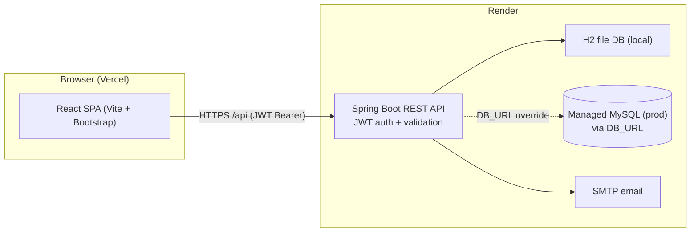

# Babysitter Booking Platform

An on-demand childcare booking platform where parents find verified babysitters and book an open time slot in under two minutes.

## Live Demo

- Frontend: `TODO — deploy to Vercel, then paste the public URL here`
- Backend API: `TODO — deploy to Render, then paste the public URL here`
- Video demo (2–4 min): `TODO — record with Loom/phone screen-recorder and link it here`

## Overview

Working parents often arrange childcare through scattered chats and calls, with no way to check a sitter's background, rates, or real availability. Sitters juggle bookings on paper and get double-booked. This platform gives parents a searchable directory of admin-verified sitters with transparent hourly rates and ratings, plus a shared slot calendar so a time window can never be booked twice.

## Architecture Diagram



Editable source: [docs/diagrams/system.drawio](docs/diagrams/system.drawio) (open in draw.io).

## Tech Stack

| Layer | Technology |
| ----- | ---------- |
| Frontend | React 18 (Vite 5) + Bootstrap 5 + Axios + React Router 6 |
| Backend | Spring Boot 4.1.0 (Java 21) |
| Auth | Spring Security + JWT (jjwt 0.11.5) |
| ORM | Spring Data JPA + Hibernate |
| Database | H2 file-based (local default) / MySQL 8 via `DB_URL` (production) |
| Build | Maven (backend), npm + Vite (frontend) |
| Testing | JUnit 5 + Mockito (59 tests, all passing) |
| API docs | springdoc-openapi (Swagger UI) |
| CI/CD | GitHub Actions (backend + frontend workflows) |
| Hosting | Render (backend) + Vercel (frontend) + managed MySQL |

## Features

- **Auth** — signup/login for Parent, Babysitter and Admin roles with JWT; bcrypt-hashed passwords; seeded admin via `POST /api/auth/seed-admin`.
- **Babysitter directory** — public listing of sitters with rating/rate filters, profiles, open slots and reviews. A sitter goes live as soon as their profile is complete (bio + real rate), no admin wait.
- **Sitter dashboard** — bio/experience/rate profile editing, availability slot management (past/overlap validation), verification status.
- **Booking engine** — slot claiming in one transaction (no double-booking), total = hourly rate × hours, lifecycle PENDING → CONFIRMED → COMPLETED/CANCELLED with role checks.
- **Reviews** — one review per completed booking by the booking parent; sitter average rating recomputed instantly.
- **Payments (sandbox)** — pending payment record per booking plus mark-paid with a fake transaction reference; no real money moves.
- **Notifications** — in-app inbox for every booking event plus best-effort SMTP email; unread counter and mark-all-read.
- **Admin panel** — pending-sitter verification, separate parent/sitter user lists with safe deletion (booked accounts protected), all-bookings oversight, platform stats.
- **Monitoring** — public `GET /api/health` liveness probe plus event logging (signup, login, bookings, errors).

## Screenshots

> TODO for the author: capture these five screens after `npm run dev` and drop the PNGs into `docs/screenshots/`, then embed them here.

1. Sitter directory with filters (`/babysitters`)
2. Sitter profile + booking form (`/babysitters/:id`)
3. Parent bookings with review box (`/my-bookings`)
4. Sitter dashboard with slots (`/dashboard`)
5. Admin verification panel (`/admin`)

## Getting Started

### Prerequisites

- Java 21+ and Maven 3.8+
- Node.js 20+ and npm
- No database setup needed locally (H2 file DB is created automatically)

### 1. Backend

```bash
cd backend
mvn spring-boot:run
```

The API starts on `http://localhost:8080`. Swagger UI: `http://localhost:8080/swagger-ui.html`. Health check: `http://localhost:8080/api/health`.

Seed the admin account (run once, idempotent):

```bash
curl -X POST http://localhost:8080/api/auth/seed-admin
# admin@babysitter.app / admin123
```

### 2. Frontend

```bash
cd frontend
npm install
npm run dev
```

Open `http://localhost:5173`. The Vite dev server proxies `/api` to the backend on port 8080.

### 3. Try the core flows

1. **Auth flow** — sign up as a parent or babysitter, then log in. The JWT is stored and attached to every request.
2. **Booking flow** — as a babysitter add availability slots, then as a parent browse the directory, pick a slot and book it. Confirm as the babysitter, complete as the parent, then leave a review.

## Environment Variables

Backend (see also [.env.example](.env.example); never commit `.env`):

| Name | Description | Required |
| ---- | ----------- | -------- |
| `PORT` | HTTP port (hosts set this; defaults to 8080) | N |
| `DB_URL` | JDBC URL (default: local H2 file; set to MySQL URL in production) | N |
| `DB_USERNAME` | Database username (default `sa` for H2) | N |
| `DB_PASSWORD` | Database password | N |
| `JWT_SECRET` | HMAC signing secret (min 32 chars; must be set in production) | Y (prod) |
| `JWT_EXPIRATION_MS` | Token lifetime in ms (default 86400000 = 24h) | N |
| `CORS_ALLOWED_ORIGINS` | Comma-separated allowed origins (add the Vercel URL in production) | N |
| `MAIL_HOST` / `MAIL_PORT` | SMTP host/port for booking emails | N |
| `MAIL_USERNAME` / `MAIL_PASSWORD` | SMTP credentials (app password for Gmail) | N |

Frontend (see [frontend/.env.example](frontend/.env.example)):

| Name | Description | Required |
| ---- | ----------- | -------- |
| `VITE_API_BASE_URL` | Backend base URL (empty locally via Vite proxy; set to `https://<render-app>/api` in production) | Y (prod) |

## API Documentation

- Local Swagger UI: `http://localhost:8080/swagger-ui.html`
- Production Swagger: `TODO — <render-app>/swagger-ui.html after deploy`
- Every response uses one envelope: `{ "success": true, "data": { }, "message": "ok" }`
- Key endpoints: `POST /api/auth/signup`, `POST /api/auth/login`, `GET /api/babysitters`, `GET /api/babysitters/{id}`, `POST /api/babysitters/me/slots`, `POST /api/bookings`, `PATCH /api/bookings/{id}/status`, `POST /api/bookings/{id}/reviews`, `POST /api/payments`, `GET /api/notifications`, `GET /api/admin/pending-babysitters`, `GET /api/admin/users`, `DELETE /api/admin/users/{id}`, `GET /api/health`

## Running Tests

```bash
cd backend
mvn -B clean verify   # compile + 68 unit tests (Mockito); fails the build on any red test
```

```bash
cd frontend
npm run lint    # ESLint style check
npm run build   # production build
```

Test layout mirrors the code: one test class per service module under `backend/src/test/java/com/college/babysitter/service/` (auth, booking, review, babysitter, availability, payment, notification, admin, mail) — 30/30 service methods covered.

## Deployment

- **CI**: push/PR to `main` runs `.github/workflows/backend.yml` (`mvn -B clean verify`) and `.github/workflows/frontend.yml` (`npm install` → `npm run lint` → `npm run build`). Red tests or lint errors block the merge.
- **CD**: on push to `main` (after green CI), the backend triggers the Render deploy hook (`RENDER_DEPLOY_HOOK` secret) and the frontend deploys to Vercel (`VERCEL_TOKEN` secret). Secrets live in GitHub Settings → Secrets and variables → Actions, never in YAML.
- **Backend (Render)**: `render.yaml` blueprint (Java 21, `rootDir: backend`, health check `/api/health`). Set `DB_URL`/`DB_USERNAME`/`DB_PASSWORD` to a managed MySQL instance (Railway/Clever Cloud/Aiven), `JWT_SECRET` to a long random string, and `CORS_ALLOWED_ORIGINS` to the Vercel URL.
- **Frontend (Vercel)**: import the repo, set root to `frontend`, build command `npm run build`, and env `VITE_API_BASE_URL=https://<render-app>/api`.
- **Database (production)**: managed MySQL via `DB_URL` — the local H2 file DB is for development only and does not persist on Render's ephemeral disk.

## Folder Structure

```
.
├── .github/workflows/   backend.yml + frontend.yml (CI/CD)
├── backend/             Spring Boot REST API
│   └── src/main/java/com/college/babysitter/
│       ├── config/      SecurityConfig, CorsConfig, SwaggerConfig, H2ConsoleConfig
│       ├── controller/  thin REST endpoints (no business logic)
│       ├── service/     business logic (unit-tested)
│       ├── repository/  Spring Data JPA interfaces
│       ├── model/       JPA entities (7 tables)
│       ├── dto/         request/response objects
│       ├── security/    JWT service, filter, principal
│       └── exception/   ApiException + global handler
├── frontend/            React single-page app (Vite + Bootstrap)
│   └── src/             api client, context, components, pages
├── docs/diagrams/       system.drawio, er.dbml + er.md, class.md
├── render.yaml          Render backend blueprint
├── .env.example         backend env template
├── Problem_Statement.md
└── CHANGELOG.md
```

## Future Enhancements

- AI sitter-match suggestions ("best sitter for Saturday evening") — natural Review-III enhancement.
- Real payment gateway (Razorpay/Stripe test mode) replacing the sandbox record.
- SMS/WhatsApp reminders for upcoming bookings.
- Recurring weekly bookings for regular childcare needs.

## License

MIT — see [LICENSE](LICENSE).

## Author / Contact

Capstone project by the repository owner (`anasahamed83965-design`). Open an issue on GitHub for questions or feedback.

<!-- commit 0:  -->
<!-- commit 1:  -->