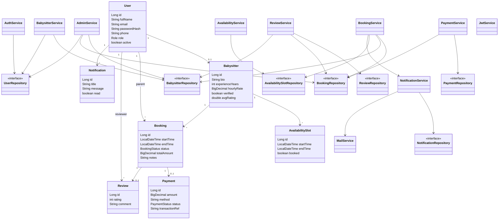

Controller layer (`AuthController`, `BabysitterController`, `BookingController`,
`ReviewController`, `PaymentController`, `NotificationController`,
`AdminController`, `HealthController`) stays thin - it validates input, calls the matching service,
and wraps the result in `ApiResponse<{ success, data, message }>`.

As-built (Day 41): added `HealthController` (`GET /api/health` liveness probe),
`MailService` (best-effort SMTP behind notifications), `H2ConsoleConfig`
(explicit H2 console servlet registration) and `UserDto` (admin user lists).
Default database is an H2 file (`./data/babysitter_db`); production overrides
it with a managed MySQL URL via `DB_URL`.
