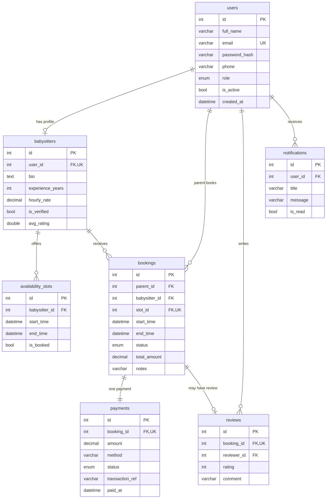

```mermaid
erDiagram
    users ||--o| babysitters : "has profile"
    babysitters ||--o{ availability_slots : "offers"
    users ||--o{ bookings : "parent books"
    babysitters ||--o{ bookings : "receives"
    bookings ||--|| payments : "one payment"
    bookings ||--o| reviews : "may have review"
    users ||--o{ reviews : "writes"
    users ||--o{ notifications : "receives"

    users {
        int id PK
        varchar full_name
        varchar email UK
        varchar password_hash
        varchar phone
        enum role
        bool is_active
        datetime created_at
    }
    babysitters {
        int id PK
        int user_id FK,UK
        text bio
        int experience_years
        decimal hourly_rate
        bool is_verified
        double avg_rating
    }
    availability_slots {
        int id PK
        int babysitter_id FK
        datetime start_time
        datetime end_time
        bool is_booked
    }
    bookings {
        int id PK
        int parent_id FK
        int babysitter_id FK
        int slot_id FK,UK
        datetime start_time
        datetime end_time
        enum status
        decimal total_amount
        varchar notes
    }
    payments {
        int id PK
        int booking_id FK,UK
        decimal amount
        varchar method
        enum status
        varchar transaction_ref
        datetime paid_at
    }
    reviews {
        int id PK
        int booking_id FK,UK
        int reviewer_id FK
        int rating
        varchar comment
    }
    notifications {
        int id PK
        int user_id FK
        varchar title
        varchar message
        bool is_read
    }
```
